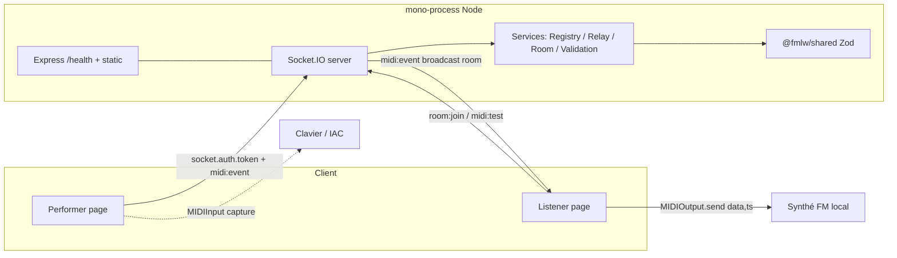

# Architecture Spine — FM Live Wire (MVP)

> Build substrate. Les invariants ci-dessous sont les appels qu'un builder ne peut pas lire sur du code conforme. La doc humaine complète est dans `ARCHITECTURE.md` ; les ADR dans `adr/`. Décisions, pas rationnel (le rationnel vit dans `.memlog.md`).

## Design Paradigm

**Monolithe modulaire en couches + couche Socket dédiée.** Un seul process Node porte Express (static + `/health`) et Socket.IO (cœur temps réel) sur un seul origin HTTPS. Quatre couches directionnelles :

- **HTTP layer** — Express, mince : sert le build Vite statique + `GET /health`. Pas de logique métier.
- **Socket layer** — Socket.IO : middlewares `io.use` (rôle/owner) + `socket.use` (gate per-event + rate limit) + handlers. Séparée de l'HTTP, ne mélange pas avec les controllers REST.
- **Services** — `PerformerRegistry`, `RelayService`, `RoomService`, `ValidationService`. Framework-indépendants (testables sans Socket.IO). `RelayService` derrière une interface → swap d'adapter futur.
- **Shared contract** — `@fmlw/shared` : `MidiEventSchema` (Zod) + types + constantes. Source unique du wire, importée front **et** back.

Frontend : **feature-based**, dépendances directionnelles `app → features → entities → shared → lib`. Les features `performer` et `listener` **ne dépendent pas entre elles**.



## Invariants & Rules

### AD-1 — Monolithe modulaire mono-process, mono-domaine HTTPS  · [ADOPTED]

- **Binds:** all (epics 1–6), NFR-12, NFR-13, NFR-8
- **Prevents:** séparation frontend/backend en deux déploiements → CORS + secure context Web MIDI fragmenté + préflight.
- **Rule:** un seul process Node porte Express (static Vite + `/health`) **et** Socket.IO sur le même origin HTTPS. Pas de Redis, pas de MQ. Modules isolés pour swap futur.

### AD-2 — One-way broadcast, owner unique  · [ADOPTED]

- **Binds:** FR-1..5, FR-19..24, NFR-11, NFR-20
- **Prevents:** un listener émettant un `midi:event` accepté ; un 2ᵉ performer prenant la main.
- **Rule:** `io.use` épingle `socket.data.role` + `socket.data.performerId = socket.id` (jamais une valeur client). `socket.use` gate per-event : `role !== "performer" || performerId !== ownerPerformerId` sur `midi:event` → `forbidden`. `PerformerRegistry` : `ownerPerformerId` single-slot ; 2ᵉ performer → `performer:busy` (refus, pas de remplacement). Events listener→serveur autorisés : `room:join`, `room:leave`, `midi:test` uniquement. Aucun handler `midi:event` côté listener, aucun handler `panic` côté serveur.

### AD-3 — Web MIDI API native, pas WEBMIDI.js (MVP)  · [ADOPTED]

- **Binds:** FR-6, FR-7, FR-15, NFR-6..8
- **Prevents:** dépendance wrapper pour 5 types channel-voice que l'API native couvre à 100 %.
- **Rule:** `navigator.requestMIDIAccess({ sysex: false })` natif. Capture performer via `MIDIInput.onmessage` (`event.data`, `event.timeStamp`). Rendu listener via `MIDIOutput.send(data, timestamp)`. Feature-detection (`'requestMIDIAccess' in navigator`) **avant** tout prompt ; Safari/non-compatible → écran terminal `Chrome/Edge requis`. Reconsidérer WEBMIDI.js si NRPN/RPN multi-CC ou SysEx deviennent nécessaires (hors MVP).

### AD-4 — Socket.IO v4 pour le relay temps réel  · [ADOPTED]

- **Binds:** FR-10, FR-11, FR-18, NFR-14
- **Prevents:** réimplémenter rooms, reconnexion, connection state recovery, acknowledgements, middlewares sur `ws` nu.
- **Rule:** pinner `socket.io` + `socket.io-client` `^4.8.3` (même major, compat 4.x↔4.x). `transports: ["websocket"]` en prod (pas de long-polling fallback). Client contrôlé uniquement (framing propriétaire Socket.IO, incompatible WS brut — OK MVP). Rooms Socket.IO pour `fm-live-wire:main`.

### AD-5 — Contrat MIDI partagé Zod dans `@fmlw/shared`  · [ADOPTED]

- **Binds:** FR-10, FR-15, FR-21, NFR-12, NFR-15
- **Prevents:** dérive du schéma wire entre front et back.
- **Rule:** source unique `MidiEventSchema` (Zod) dans `packages/shared`, importée front+back via `"@fmlw/shared": "workspace:*"`. Schéma strict : rejette champs inconnus, hors-plages, `v !== 1` (`unsupported-version`). Champs communs `v/type/channel/roomId/seq/ts` + conditionnels par type. `channel` 0–15 (data) / 1–16 (UI, conversion −1 à l'edge). `pitchBend` 14-bit 0–16383 (8192 = centre). `performerId` **interdit/ignoré** dans le payload — le serveur attache `socket.id`. Pas de type SysEx dans le schéma.
- **Note:** Zod 3 `^3.23` (via `zod/v3`) ADOPTED MVP (`.strict()` stable). Migration Zod 4 (`z.strictObject()`) éventuelle post-traction.

### AD-6 — État en mémoire, pas de DB (MVP)  · [ADOPTED]

- **Binds:** NFR-13
- **Prevents:** coupler le MVP à une persistance ; bloquer le swap futur vers Redis Streams adapter.
- **Rule:** `ownerPerformerId`, `listeners: Map`, `rateLimitBuckets: Map` en mémoire volatile. Perte d'état au redémarrage acceptée. `RelayService` derrière une interface d'adapter (`broadcast(room, event)`) → swap vers Redis Streams adapter multi-instance **sans rewrite** des handlers. Pas de TanStack Query (pas d'API REST métier) ; client state via Zustand.

### AD-7 — Panic local côté listener  · [ADOPTED]

- **Binds:** FR-16, FR-17, FR-18, FR-24, S-2
- **Prevents:** une note coincée sans issue quand le serveur est down.
- **Rule:** `features/listener/lib/panic.ts` ne dépend **pas** de l'état de connexion Socket.IO — uniquement de la `MIDIOutput` locale sélectionnée. Panic = CC 64→120→121→123 × 16 canaux = 64 messages, `send(data, performance.now())`. Force Panic (opt-in, confirmation Dialog) = noteOff sweep 128×16 = 2048 messages. **Aucun handler panic côté serveur** ; le Panic fonctionne serveur déconnecté. `PanicButton` sticky viewport, jamais désactivé.

### AD-8 — Exclusion SysEx du MVP (double défense)  · [ADOPTED]

- **Binds:** FR-8, NFR-20
- **Prevents:** injection firmware malveillante + DoS via SysEx non borné.
- **Rule:** double défense — (1) performer filtre tout message `event.data[0] === 0xF0` (jamais envoyé au serveur) ; (2) `MidiEventSchema` n'expose **aucun** type SysEx → rejet automatique côté serveur. `requestMIDIAccess({ sysex: false })` côté navigateur. SysEx silencieusement filtré, jamais affiché ni relayé.

### AD-9 — Wire format JSON compact `v:1`

- **Binds:** NFR-15
- **Prevents:** overhead de debuggabilité (binaire illisible) à l'échelle humaine.
- **Rule:** événement channel-voice ~6 champs, JSON ~80–120 B négligeable à 100–200 ev/s. Apporte Zod + logs lisibles. Binaire (MessagePack) justifié seulement à plusieurs milliers d'ev/s — hors MVP.

### AD-10 — Auth owner par shared secret `OWNER_SECRET` (vs JWT)

- **Binds:** FR-2, NFR-9, NFR-10
- **Prevents:** fuite du secret owner dans le bundle Vite (`VITE_*` inliné statiquement).
- **Rule:** `OWNER_SECRET` env serveur uniquement, **jamais** de variable `VITE_*`. Performer = page statique publique ; saisie manuelle du token à chaque session → `socket.auth.token` au handshake. `io.use` compare via `crypto.timingSafeEqual` ; erreurs génériques (anti-énumération). Pas de `localStorage` MVP ; token jamais dans l'URL ; `.env` gitignored, `.env.example` sans valeurs. Vérification `grep` du build = zéro secret.

### AD-11 — Scheduler listener `send(data, ts)` + lookahead simple

- **Binds:** NFR-1, NFR-5, FR-25, FR-26
- **Prevents:** jitter des timers JS + queue infinie de retard.
- **Rule:** `target = performance.now() + LOOKAHEAD_MS` (40 ms par défaut, configurable 30–50, **défaut confirmé 2026-07-06**). `MIDIOutput.send(data, target)` → scheduling driver-level (anti-jitter). Si `srvTs - ts > MAX_LATE_MS` (200 ms par défaut, **confirmé 2026-07-06**) → **fallback immédiat** pour noteOn/noteOff (ne pas perdre la note), drop acceptable pour CC haute-fréquence. `BUFFER_CAP = 256` : au-delà, drop oldest + warning UI local. **Pas de re-loging** (pas de compensation avancée MVP) ; `srvTs` ajouté pour télémétrie uniquement. Valeurs `LOOKAHEAD_MS`/`MAX_LATE_MS` tunables après tests réels (politique fallback/drop par type figée).

### AD-12 — Remappage forcé du canal listener

- **Binds:** FR-13, FR-15
- **Prevents:** ambiguïté multi-timbrale — un listener single-timbral entend tout fusionné sur son canal (comportement **attendu**).
- **Rule:** tout événement reçu est rerouté vers le canal choisi par le listener (0–15 data) avant `send`. Le canal d'origine du performer est **remplacé**. Conversion UI 1–16 ↔ data 0–15 à l'edge.

### AD-13 — Rate limiting per-socket token bucket

- **Binds:** FR-22, NFR-3
- **Prevents:** contournement via frames WebSocket (les limiteurs HTTP ne voient pas les frames WS).
- **Rule:** `socket.use` token bucket per-socket : capacité burst 200, refill 100/s par performer. Dépassement → `rate:limited` + log échantillonné. Un listener n'émet jamais `midi:event` (gate AD-2).

### AD-14 — Mock MIDI Output à chaud

- **Binds:** FR-12, NFR-19
- **Prevents:** bloquer le pipeline de validation sans IAC/Dexed.
- **Rule:** `MockMidiOutput` implémente `{ send(bytes, ts) }` → visualise les bytes à l'écran. Sélectionnable dans le dropdown sortie = `Mock / Debug`. **Switch Mock à chaud autorisé** même après sélection d'un port réel. Pipeline socket→scheduler→encode testable en CI + démo sans périphérique.

### AD-15 — Origin allowlist + mono-domaine (anti-CSWSH)

- **Binds:** FR-23, NFR-13
- **Prevents:** cross-site WebSocket hijacking + préflight CORS.
- **Rule:** `origin: process.env.PUBLIC_ORIGIN` au upgrade HTTP. Zéro CORS (single origin mono-process). HTTPS obligatoire (secure context Web MIDI).

### AD-16 — Déconnexion listener après 3 `forbidden` (pas de ban persistant)

- **Binds:** FR-19, Q-UX1
- **Prevents:** flood d'un listener tentant `midi:event`.
- **Rule:** 3 tentatives `forbidden` → le serveur déconnecte le listener. Pas de ban persistant MVP. UI : « Connexion interrompue : action non autorisée. »

### AD-17 — Fail-safe musical déconnexion

- **Binds:** FR-24
- **Prevents:** notes orphelines à la déconnexion listener ou perte de sortie MIDI.
- **Rule:** le scheduler arrête d'envoyer à la déconnexion ou perte de port (pas de bytes en vol). À la reconnexion (Socket.IO connection state recovery), reprise du flux live **sans re-loger** le passé (pas de replay).

### AD-18 — Logs structurés échantillonnés

- **Binds:** FR-30
- **Prevents:** flood de log par `midi:event`.
- **Rule:** pas de log par event. Logger : connexions/déconnexions, changements de room, erreurs de validation (échantillonnées 1/N avec `seq` + raison), hits rate-limit (compteur agrégé + flush périodique), Panic déclenché. `LOG_MIDI=1` pour debug dev.

### AD-19 — Tests : unitaires 100 % + intégration in-process + validation manuelle

- **Binds:** NFR-16, NFR-17, NFR-18
- **Prevents:** régression sur mapping/panic/scheduler/schema/registry/rate-limit.
- **Rule:** Vitest + jsdom + `web-midi-test` (mock `requestMIDIAccess`). Socket.IO in-process pour intégration. `MockMidiOutput` pour CI. Plan manuel IAC→Dexed→MIDI Monitor (11 étapes). `grep` du build = zéro secret.

### AD-20 — Déploiement HTTPS mono-domaine

- **Binds:** NFR-8, NFR-13
- **Prevents:** secure context Web MIDI fragmenté.
- **Rule:** mono-process Express sert static Vite + Socket.IO sur même origin. Caddy auto-TLS ou host managé (Render/Fly.io). `GET /health` → `{ ok, uptime, ownerActive: boolean, listeners: n }` (`ownerActive` pour polling landing). Graceful shutdown : notify clients, drain, `io.close()`. Env : `PORT`, `OWNER_SECRET`, `PUBLIC_ORIGIN`, `LOG_MIDI`, `MAX_LISTENERS` (garde-fou optionnel).

## Consistency Conventions

| Concern | Convention |
| --- | --- |
| Naming entités/events | `midi:event`, `room:join`, `room:leave`, `midi:test` (listener→serveur) ; `performer:busy`, `forbidden`, `rate:limited`, `unsupported-version`, `invalid` (erreurs). Room MVP : `fm-live-wire:main` (constante, imposée par le serveur). |
| Wire format | JSON compact `v:1`. `channel` 0–15 sur le wire, 1–16 dans l'UI. `seq` uint32 monotone par performer. `ts` DOMHighResTimeStamp. `performerId` jamais dans le payload. `srvTs` ajouté serveur (télémétrie). |
| Erreurs / acks | ack `{ ok: boolean, error?: code, issues?: ZodIssue[] }`. Codes stables : `invalid`, `forbidden`, `rate:limited`, `performer:busy`, `unsupported-version`. Messages UI génériques côté auth (anti-énumération). |
| Validation | Zod `.strict()`/`z.strictObject()` partout. Validation 3 couches serveur : connexion (`io.use`) → event (`socket.use` gate+rate) → handler (`safeParse`). Listener : range checks avant `send`. |
| Sécurité | Rôle épinglé `socket.data.role` non modifiable. `performerId = socket.id` (jamais client). `OWNER_SECRET` serveur-only, timing-safe, jamais `VITE_*`. Origin allowlist au upgrade. |
| State / mutation | État serveur en mémoire, muté uniquement par les services (`PerformerRegistry`, `RoomService`). Pas de mutation directe du state socket depuis les handlers. Client state Zustand. |
| Logging | Structuré JSON, échantillonné pour le flux MIDI. Jamais de log par event. `LOG_MIDI=1` active le flux complet en dev. |
| Timing | `LOOKAHEAD_MS=40`, `MAX_LATE_MS=200`, `BUFFER_CAP=256` (constantes configurables). `send(data, performance.now() + lookahead)`. Fallback immédiat noteOn/noteOff, drop CC HF. |
| Panic | Local uniquement, `panic.ts` indépendant de Socket.IO. CC 64→120→121→123 ×16. Force Panic 128×16 opt-in confirmé. |
| Mapping wire→bytes | Déterministe 1:1 : noteOn `0x90\|ch`, noteOff `0x80\|ch`, CC `0xB0\|ch`, programChange `0xC0\|ch` (2 bytes), pitchBend `0xE0\|ch` lsb/msb. velocity 0 = noteOff. |
| Dépendances (front) | `app → features → entities → shared → lib`. Features `performer`/`listener` isolées. `entities/MidiEvent` = source unique du contrat. **Enforced via plugin ESLint** (ex. `eslint-plugin-bound-modules`), pas seulement revue. |
| Dépendances (back) | `http` et `socket` séparés ; `handlers → services → shared`. `RelayService` derrière interface d'adapter. **Enforced via plugin ESLint.** |
| Build `@fmlw/shared` | `tsc` (MVP) — consommé ESM des deux côtés. Pas de `tsup` au départ. |

## Stack

> SEED — vérifiée juillet 2026. Le code possède ceci une fois existant. Version majeure pin ; patch à figer au scaffolding via `pnpm outdated`.

| Name | Version |
| --- | --- |
| Node.js | LTS ≥ 22/24 |
| TypeScript | 5.6+ |
| React / react-dom | 19.x |
| Vite | 6.x |
| socket.io / socket.io-client | ^4.8.3 (même major, déc. 2025) |
| express | 5.2.1 — ADOPTED MVP (Node 18+) |
| zod | ^3.23 (via `zod/v3`) — ADOPTED MVP (`.strict()` stable) ; migration v4 (`z.strictObject()`) post-traction |
| zustand | 5.x |
| shadcn/ui + Tailwind | latest |
| vitest + jsdom | 2.x |
| web-midi-test | latest (jazz-soft) |
| pnpm workspaces | latest (monorepo) |

## Structural Seed

```text
fm-live-wire/
  pnpm-workspace.yaml          # packages: apps/*, packages/*
  package.json                 # scripts root: dev, build, test, lint
  tsconfig.base.json           # TS strict partagé
  .env.example                 # OWNER_SECRET, PUBLIC_ORIGIN, PORT, LOG_MIDI (sans valeurs)
  .gitignore                   # .env, .env.*.local, dist, node_modules
  apps/
    web/                       # React + Vite + TS (listener + performer + landing)
      vite.config.ts
      src/
        app/                   # providers (SocketProvider, MidiAccessProvider), router, layouts
        features/
          performer/           # components/ hooks/ lib/ api/ index.ts — self-contained
          listener/            # components/ hooks/ lib/ (scheduler, panic, encode, mock) index.ts
        entities/              # MidiEvent (re-export @fmlw/shared), Channel, Role
        shared/                # UI primitives shadcn, constantes (CC 120/121/123, status bytes)
        lib/                   # socket client Socket.IO, midi-access wrapper
        config/                # runtime config (LOOKAHEAD_MS, BUFFER_CAP defaults UI)
    server/                    # Node + Express + Socket.IO
      src/
        config/                # env (PORT, OWNER_SECRET, PUBLIC_ORIGIN, lookahead defaults)
        app/                   # Express wiring + http server + Socket.IO attach
        http/routes/           # health.ts, static serving
        socket/
          index.ts             # io.on("connection") + middleware wiring
          middlewares/         # roleAuth (io.use), eventGate (socket.use), rateLimit (socket.use)
          handlers/            # performerEvents (midi:event), roomEvents (join/leave), controlEvents (midi:test) — PAS de handler panic
          services/            # PerformerRegistry, RelayService (interface adapter), RoomService, ValidationService
        shared/                # re-export @fmlw/shared, constants, logger
        utils/                 # token bucket, logger échantillonné
  packages/
    shared/                    # CONTRAT — pas de logique métier
      src/
        midi-event.ts          # MidiEventSchema (Zod) + z.infer type
        constants.ts           # CC 120/121/123, status bytes, ROOM = "fm-live-wire:main"
        index.ts
      package.json             # "name": "@fmlw/shared", "exports": ...
  docs/adr/                    # ADR-0001..ADR-0008 (Nygard léger, immuables, supersede-only)
```

## Capability → Architecture Map

| Capability / Area | Lives in | Governed by |
| --- | --- | --- |
| Capture MIDI performer (FR-6,7,9) | `apps/web/src/features/performer` (hooks/useMidiInput, lib/encode) | AD-3, AD-5, AD-8, AD-12 |
| Relay broadcast (FR-10,11) | `apps/server/src/socket/services/RelayService` + handlers | AD-2, AD-4, AD-6 |
| Contrat wire (FR-10,15,21) | `packages/shared` (`MidiEventSchema`) | AD-5, AD-9 |
| Rôles / owner unique (FR-1..5) | `socket/middlewares/roleAuth` + `services/PerformerRegistry` | AD-2, AD-10, AD-15 |
| Gate per-event + rate limit (FR-19,22) | `socket/middlewares/eventGate`, `rateLimit` | AD-2, AD-13, AD-16 |
| Validation stricte (FR-21) | `services/ValidationService` + `@fmlw/shared` | AD-5, AD-8 |
| Rendu listener + scheduler (FR-11..15, NFR-5) | `features/listener` (lib/scheduler, encode, hooks/useMidiReceiver) | AD-3, AD-11, AD-12 |
| Backpressure (FR-25..27) | `features/listener/lib/scheduler` (BUFFER_CAP, MAX_LATE_MS) | AD-11 |
| Panic local (FR-16,17,18,24) | `features/listener/lib/panic` (indépendant Socket.IO) | AD-7, AD-17 |
| Mock Output (FR-12, NFR-19) | `features/listener/lib/mock-output` | AD-14 |
| SysEx exclusion (FR-8) | performer filtre + `MidiEventSchema` | AD-8 |
| Health / ops (FR-28,29,30) | `http/routes/health`, `app/` shutdown, logger | AD-18, AD-20 |
| Sécurité owner (FR-2, NFR-9,10) | `io.use` timing-safe + env serveur | AD-10, AD-15 |
| Déploiement HTTPS (NFR-8,13) | mono-process Express + Caddy/managé | AD-1, AD-20 |
| Tests (NFR-16,17,18) | `apps/*/tests`, `web-midi-test`, plan manuel | AD-19 |

## Deferred

- **Rooms multiples** (post-traction prioritaire, Q-UX11) : `roomId` arbitraire, `room:create`/`room:join` auth-gated. L'adapter `RelayService` (AD-6) et le champ `roomId` du contrat (AD-5) préparent le swap sans rewrite. Impact UX : sélecteur de room sur la landing.
- **SysEx / patches DX7** : double défense (AD-8) déjà en place ; ajout d'un type `sysex` au schéma + flag `sysex:true` côté navigateur. Hors MVP.
- **Replay / radio générative** : `seq` uint32 (AD-5) prépare le replay ; pas de re-loging MVP (AD-11). Hors MVP.
- **Multi-performers / summing** : `PerformerRegistry` single-slot (AD-2) à généraliser en registry multi. Hors MVP, mode futur séparé.
- **Auth JWT + RBAC** : `socket.auth` + `io.use` (AD-10) préparent le swap vers JWT signé. Hors MVP.
- **Scale-out multi-instance** : `RelayService` interface d'adapter (AD-6) → Redis Streams adapter. Hors MVP.
- **Compensation latence avancée** (RTT, alignement d'horloges, predictive scheduling) : hors MVP (AD-11).
- **Polyfill Safari JZZ** : feature-detection (AD-3) suffit MVP.
- **Tunings** : `MAX_LATE_MS=200`/`LOOKAHEAD_MS=40` confirmés par défaut 2026-07-06 ; calibrage en conditions réelles post-tests (politique fallback/drop par type figée).